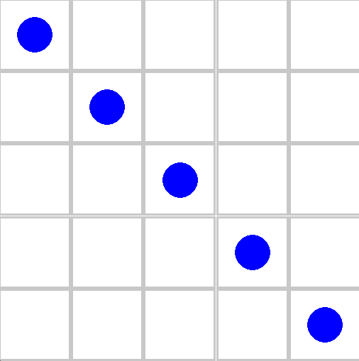

# Network Environment and Fake Simulator
This repository contains the implementation of two main elements of the SDN controller load balancing project. Namely, it's the elements of the project that do not require OpenFlow or Mininet access.
1. Network RL Environment (Gymnasium)
2. "Fake" Simulator

I recommend creating a conda (or similar) python environment with version 3.13, as this has been tested. 
You can view `requirements.txt` to determine which python libraries are required to run the environment. 

## Network RL Environment
Following the gynmasium (openAI gym) environment interface, the network_env is designed to interface with either the fake sim, or the [live network simulator](https://github.com/WilliamDormer/SDNLoadBalancing).  
To run, first use `pip install -e network_env`, which install the network environment library in editable mode (allowing for changes if you want, otherwise discard the -e option.).  
Then see one of the "train_*" scripts to see how to use and load the environment. 
- `train_ddqn.py`: Training for the Double Deep Quality Network
- `train_DQN.py`: Training for the Deep Quality Network
- `train_DQN_episodes.py`: Training for the DQN with support for episodes.
- `train_DQN_episodes_norm.py`: Training for the DQN with support for episodes and normalization.
- `train_PPO.py`: Training for an alternate RL scheme, PPO.

For each, you can look at the arguments at the top of the file to determine how to run the script.
The model files from training should be saved in the `./saves` folder. 

To evaluate the effectiveness of the model(s) we provide several evaluation scripts, which compare the models against the three baselines (Static, Threshold, Random):
- `evaluate_ddqn.py`: Evaluates the DDQN.
- `evaluate.py` : Evaluates all other model types.

The environment also provides a rendering option so that you can view the state, which is particularly useful for evaluation, to determine if the model has produced a useful policy. 

## Fake Simulator
The fake simulator generates traffic that simulates the live netwrok environment. To run, use `sim.py` in a separate terminal window, which will begin the server. See the arguments in the file for inputs. Ensure that the number of switches and controllers matches the number in the environment used. 

The fake simulator provides support for different initial switch configurations, and different traffic generation patterns. 
